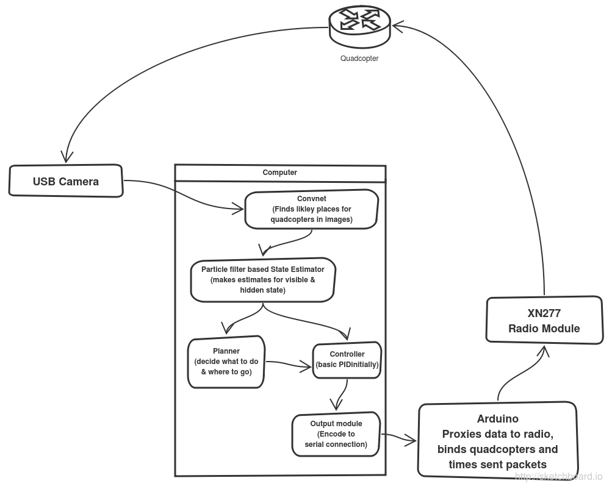

Formation Flying Quadcopters
============================

This project is to take very cheap RC quadcopters (Cheerson CX10 used) and use a computer to remote control them with greater accuracy than a human could to allow formation flying and collaborative task completion.

Architecture
------------

Project Status
--------------

All experimental.   Nothing works fully yet.

Build log
---------

1. Messages successfully sent to/from quadcopter using bus-pirate -> SPI -> XN297 -> quadcopter.  Determined on-air timing was critical to message acceptance.
2. Initial convnet working to find basic quadcopter moving objects.  Lots of tweaking still possible for better performance.
3. Added training data video with the first ~300 frames manually annotated.
4. We now have a flying quadcopter (provided you are willing to type throttle adjustments into a console!)

Things to do
------------

1.  Currently the arduino code has a two stage process to find a quadcopter, then fly it.   Eventually, we would like to be able to be flying quadcopters while simultaniously hunting for new ones.   That will likley require channel hopping to the bind channel to send out a few announcement packets and waiting for replies while still keeping existing clients happy.   It should also send some kind of message back to the host PC to tell it a new quadcopter is in the game.
